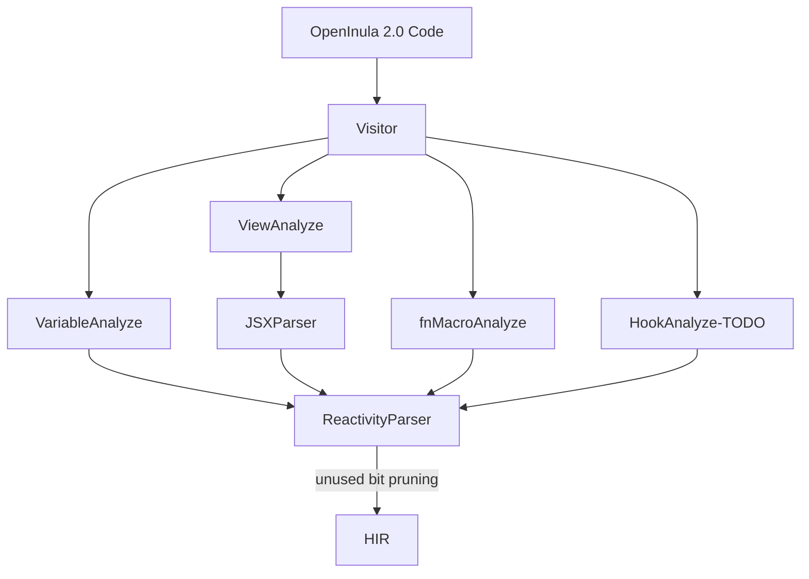

# OpenInula 2.0 Parser

This document describes the OpenInula 2.0 parser, which is used to parse the 2.0 API into a HIR (High-level Intermediate
Representation) that can be used by the OpenInula 2.0 compiler.

## Workflow

## Data Structure
see `types.ts` in `packages/transpiler/babel-inula-next-core/src/analyze/types.ts`

## TODO LIST
- [ ] for analyze the local variable, we need to consider the scope of the variable
- [ ] hook analyze
