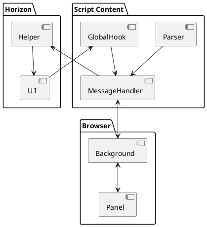
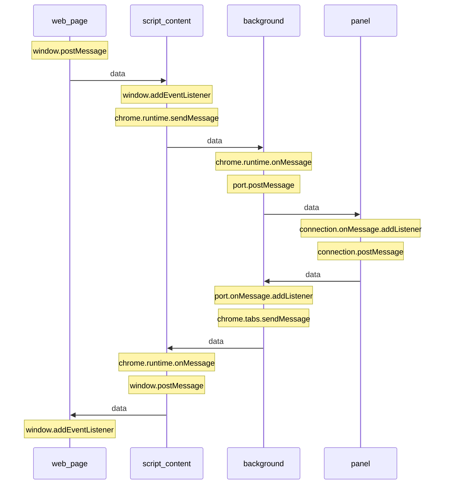

## 为什么要做 devTool 插件
让Horizon开发者获得更好的开发体验，获取准确的组件树结构、状态信息和真实dom对应关系。

## 上下文关系
devTool功能的实现依赖浏览器 extension 开放的能力，用于绘制展示组件信息和获取真实 dom 元素。同时也需要 Horizon 提供相关接口获取组件树信息和提供调试能力。

## 目标
1. 查看组件树结构并支持过滤
2. 查看组件与真实dom的关系
3. 查看组件props, state, hooks 等信息
4. 调试单个组件及其子组件
5. 支持状态管理解决方案调试

## 和 react devTool 能力对比
||react | Horizon|
|-|-|-|
|查看组件树|Y |Y |
|查看真实DOM|Y|Y|
|查看组件信息|Y|Y|
|调试能力|Y| Y |
|性能调试|Y|N|
|解析Hook名|Y|N|
|状态管理解决方案调试|N|Y|

## 架构草图


#### 说明
Helper: 提供接口给插件操控组件以及提供工具方法。
Parser: 负责将组件树结构和组件信息解析成特定的数据结构，供Panel展示。

## 文件清单说明：
devtools_page: devtool主页面
default_popup: 拓展图标点击时弹窗页面
content_scripts: 内容脚本，在项目中负责在页面初始化时调用注入全局变量代码和消息传递

## 打开 panel 页面调试面板的方式

1. Open the developer tools.
1. Undock the developer tools if not already done (via the button in the bottom-left corner).
1. Press Ctrl + Shift + J to open the developer tools of the developer tools.
Optional: Feel free to dock the developer tools again if you had undocked it at step 2.
1. Switch from "<top frame>" to devtoolsBackground.html (or whatever name you have chosen for your devtools). (example)
1. Now you can use the Console tab to play with the chrome.devtools API.

## 全局变量注入
通过content_scripts在document初始化时给页面添加script脚本，在新添加的脚本中给window注入全局变量

## 通信方式：


## 传输数据结构
**<font color=#8B0000>限制：chrome.runtime.sendMessage只能传递 JSON-serializable 数据</font>**


```ts
type passData = {
  type: 'HORIZON_DEV_TOOLS',
  payload: {
    type: string,
    data: any,
  },
  from: string,
}
```

## horizon和devTools的主要交互
- App初始渲染
- App更新
- App销毁
- 整个页面刷新
- devTools触发组件属性更新


## 对组件的操作
我们希望插件和Horizon能够尽量解耦，所以Horizon提供了Helper注入给插件，提供相关方法操作组件。

## 触发组件更新方式
- 类组件的state：调用实例的 setState 函数触发更新
- 类组件的props：浅复制props后更新props值并调用 forceUpdate 触发更新
- 函数组件的props：新增了devProps属性，在特定时刻重新给props赋值，触发更新
- 函数组件的state：调用 useState 函数触发更新

## VNode的清理
全局 hook 中保存了root VNode，在解析 VNode 树的时候也会保存 VNode 的引用，在清理VNode的时候这些 VNode 的引用也需要删除。

## 数据压缩
渲染组件树需要知道组件名和层次信息，如果把整个vNode树传递过来，传递对象太大，最好将数据进行压缩然后传递。
- 相同的组件名可以进行压缩
- 每个vNode有唯一的 path 属性，可以作为标识使用
- 通过解析 path 值可以分析出组件树的结构

## 组件props/state/hook等数据的传输和解析
将数据格式进行转换后进行传递。对于 props 和 类组件的 state，他们都是对象，可以将对象进行解析然后以 k-v 的形式，树的结构显示。函数组件的 Hooks 是以数组的形式存储在 vNode 的属性中的，每个 hook 的唯一标识符是 hIndex 属性值，在对象展示的时候不能展示该属性值，需要根据 hook 类型展示一个 state/ref/effect 等值。hook 中存储的值也可能不是对象，只是一个简单的字符串或者 dom 元素，他们的解析和 props/state 的解析同样存在差异，需要单独处理。


## 滚动动态渲染 Tree
考虑到组件树可能很大，所以并不适合一次性全部渲染出来，可以通过滚动渲染的方式减少页面 dom 的数量。我们可以把树看成有不同缩进长度的列表，动态渲染滚动列表的实现可以参考谷歌的这篇文章：https://developers.google.com/web/updates/2016/07/infinite-scroller 这样，我们需要的组件树数据可以由树结构转变为数组，可以减少动态渲染时对树结构进行解析时的计算工作。

## 虚拟列表针对 UI 框架的优化
列表中增减不同 key 项意味着 dom 增删，我们需要让框架尽可能减少 dom 操作。
- 不管渲染列表项怎么变化，应该始终以 index 作为 key，这样只会更新 dom 的属性，不会有 dom 增删操作。
- 如果在滚动过程中，一个 item 没有被移出渲染列表，它在列表中的 key 值不应该发生变化，由于 item 本身的数据没有变化，所以渲染的 children 也不会发生变化。结合上条的结论，它的属性值也不会变化，所以该 item 对应的 dom 都不会更新。

## 开发者页面打开场景
- 先有页面，然后打开开发者工具：工具建立连接，发送通知，页面hook收到后发送VNode树信息给工具页面
- 已经打开开发者工具，然后打开页面：业务页面渲染完毕，发送VNode树信息给工具页面

## 开发者工具页面响应组件树变更
组件树变更会带来新旧两个组件树信息数组，新旧数组存在数据一致而引用不一致的情况，而VTree和VList组件中相关信息的计算依赖引用而非数据本身，在收到新的组件树信息后需要对数据本身进行判断，将新数组中的相同数据使用旧对象代替。

## 测试框架
jest测试框架不提供浏览器插件的相关 api，我们在封装好相关 api 后需要模拟这些 api 的行为从而展开测试工作。

